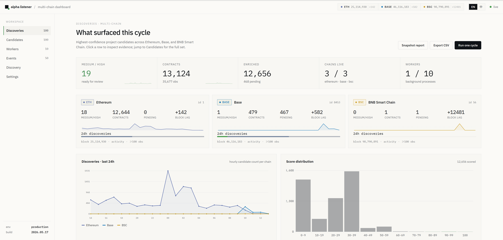
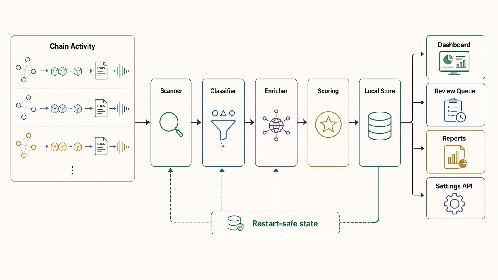
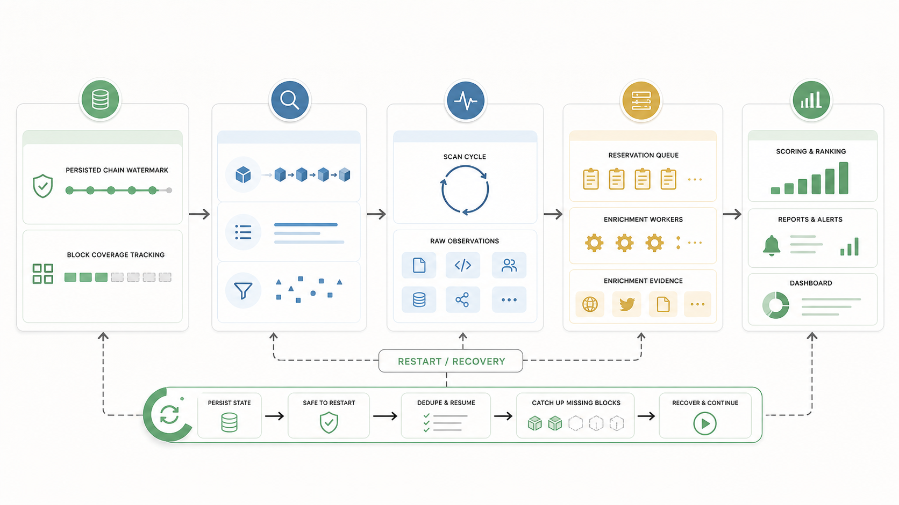
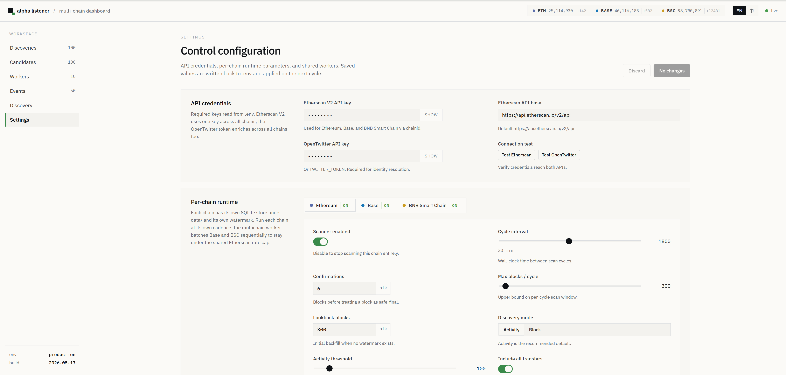

# On-Chain Alpha Radar

<p align="center">
  
</p>

On-Chain Alpha Radar is a local-first discovery system for early EVM project surfaces. It is built for the stage before a project becomes easy to find through listings or dashboards: fresh tokens, NFT mints, mining and reward contracts, DEX pool launches, claim or staking systems, game contracts, and other contract-centered experiments that first appear as on-chain activity.

The system watches recent confirmed activity on Ethereum, Base, and BNB Smart Chain, records high-signal contracts, classifies the on-chain surface with Etherscan V2 metadata, enriches candidates through OpenTwitter search/profile endpoints and website checks, scores the project, and stores every step locally. Interrupted runs resume from durable chain watermarks and block coverage records, so downtime is treated as a backfill problem rather than a lost-observation problem.

The intended operator workflow is continuous discovery: lightweight scanners keep chain coverage moving, classification separates useful project surfaces from infrastructure noise, enrichment resolves official Twitter/X accounts and websites, scoring ranks projects for review, and the dashboard provides a centered local command surface for queue health, candidates, evidence, and settings.

## Product Overview

The project is designed around four practical requirements:

- **Find early project surfaces from chain activity.** Activity mode scans ERC20/ERC721 transfers, zero-address mints, ERC1155 mints, DEX pool creation or initialization, Balancer registration, and sparse custom claim/mine/reward topics. It only promotes contracts that cross activity thresholds or carry stronger launch signals.
- **Separate official identity from discussion noise.** Twitter/X search results, scanner accounts, tracker posts, and casual address chatter are stored as evidence, but `medium` and `high` scores require official-looking identity support from a matching account or accepted website.
- **Keep the runtime restart-safe.** Per-chain SQLite stores keep watermarks, block coverage, observations, queue reservations, enrichments, reviews, report snapshots, and worker heartbeats. Crashed or interrupted workers can recover stale processing rows and continue.
- **Support human review and publishing hygiene.** The dashboard, CSV/JSON exports, Markdown review packs, website checks, and project-group reports make the output reviewable without exposing local data, generated snapshots, or secrets in git.

## Architecture

<p align="center">
  
</p>

The runtime is intentionally split into small roles that share the same local state:

- **Chain Activity** is drawn as a generic input layer rather than fixed chain logos, so additional EVM chain profiles can be added without changing the product model.
- **Scanner** advances each chain watermark and records raw observations from activity surfaces.
- **Classifier** drains Etherscan-only `classification_deferred` backlog, identifies useful contract surfaces, and skips low-surface infrastructure without spending OpenTwitter quota.
- **Enricher** consumes the priority queue, resolves official Twitter/X and website evidence, refreshes website/source checks, recomputes scores, and updates reports.
- **Dashboard API** reads the same SQLite/runtime state and writes local `.env` settings through a localhost-only API, masking secrets by default and revealing them only on explicit local request.

## Restart-Safe Data Flow

<p align="center">
  
</p>

The listener treats continuity as part of the product. Each normal scan cycle records block coverage and only advances `meta.last_scanned_block` for non-replay work. If recent coverage has a gap, the next normal scan rewinds to just before the missing block range and records a repair event. Enrichment workers reserve rows before doing slower OpenTwitter/source work; reservations older than the stale threshold are released by startup recovery and by later worker cycles. Reports, review decisions, latest project groups, website checks, and cycle heartbeats are persisted so the dashboard and CLI can explain what happened after a restart.

## Quick Start

Run one bounded cycle:

```powershell
.\scripts\run-once.ps1 --lookback-blocks 20 --max-blocks 5 --enrich-limit 3
.\scripts\run-once.ps1 --chain base --max-blocks 20 --enrich-limit 0 --no-twitter
.\scripts\run-once.ps1 --chain bsc --max-blocks 20 --enrich-limit 0 --no-twitter
```

Replay a specific block range and recompute enrichment for saved contracts:

```powershell
.\scripts\run-once.ps1 --start-block 25107646 --end-block 25107646 --enrich-limit 2 --force-enrich
```

Process only the enrichment queue without scanning more blocks:

```powershell
.\scripts\run-once.ps1 --max-blocks 0 --enrich-limit 20
```

Run continuously:

```powershell
.\scripts\run-listener.ps1 --interval-seconds 300
```

Open the local frontend dashboard:

```powershell
.\scripts\run-dashboard.ps1
# then open http://127.0.0.1:8765/
```

The dashboard lives under `frontend/dashboard`. Its `data.js` file is generated from the local SQLite stores, latest project groups, runtime metadata, queue state, and recent events. While the dashboard server is running, `data.js` is refreshed on page/data requests at the configured `--refresh-seconds` cadence. To regenerate the data file without serving HTTP:

```powershell
.\scripts\run-dashboard.ps1 --no-serve
```

The dashboard is designed for a wide operator screen: the main pane stays centered inside the available workspace, while the sidebar and top chain status remain fixed scanning anchors. The overview page summarizes the active chain heads, candidate counts, enrichment backlog, worker health, discovery time series, score distribution, tier funnel, category mix, and DEX pool initialization activity.

<p align="center">
  
</p>

Settings are read from `.env` through the local dashboard API. API keys are rendered masked by default; clicking `show` reveals the currently configured local value in the browser, and `Save & apply` writes changed values back to `.env`. Runtime-generated `frontend/dashboard/data.js` is ignored by git so a published checkout does not include local SQLite snapshots, addresses, or private configuration.

When the stored scan watermark is behind the confirmed chain head, continuous mode keeps cycling with a short catch-up sleep instead of waiting the full interval after every batch. Once caught up, it returns to the configured interval. Scanning records candidates quickly; slower contract classification, source checks, OpenTwitter lookup, and scoring are handled through the enrichment queue.

Run in the background with logs:

```powershell
.\scripts\start-background-all.ps1
.\scripts\stop-background-all.ps1
.\scripts\start-background-dashboard.ps1
.\scripts\stop-background-dashboard.ps1

.\scripts\start-background-listener.ps1 --interval-seconds 1800
.\scripts\start-background-classifier.ps1 -BatchLimit 50 -IntervalSeconds 300 -CatchupIntervalSeconds 5
.\scripts\start-background-enricher.ps1 --interval-seconds 60
.\scripts\stop-background-listener.ps1
.\scripts\stop-background-classifier.ps1
.\scripts\stop-background-enricher.ps1
```

Run Base and BNB Smart Chain as a periodic, sequential batch worker:

```powershell
.\scripts\run-multichain-once.ps1
.\scripts\start-background-multichain.ps1 -IntervalSeconds 1800
.\scripts\stop-background-multichain.ps1
```

The multichain worker intentionally scans Base and BSC sequentially rather than starting six more concurrent workers. That keeps the shared Etherscan V2 key below the configured request rate while still covering every block range through each chain's persisted watermark. Ethereum, Base, and BSC default to `activity` discovery mode: they scan range logs for zero-address token/NFT mints, ordinary ERC20/ERC721 `Transfer` activity, ERC1155 mints, newly created DEX pool swap activity, and sparse claim/mine/mint/reward custom event topics, aggregate interaction counts, and only check newly created contracts after they cross the chain's activity threshold. The default threshold is 100 observations on every chain. This avoids per-block `eth_getBlockByNumber` deployment scans and ignores tiny projects until they show real propagation. The default Ethereum profile scans up to 300 blocks per 30-minute cycle. Base assumes about 2s blocks and uses 30-block multichain catch-up batches with up to 30 rounds by default, while BSC follows the post-Fermi sub-second cadence with about 0.45s blocks and scans up to 5000 blocks per batch. If downtime leaves a larger lag, `run-multichain-once.ps1` runs catch-up scan batches in round-robin order across configured chains before sleeping, so a heavily lagged Base queue cannot starve BSC visibility for an entire multichain pass.

Use `start-background-all.ps1` after a machine reboot or interruption when you want the standard worker topology restored in the correct order. It runs stale processing recovery once before any worker starts, then starts the scanner, the Etherscan-only classifier, the OpenTwitter enricher, and the local dashboard service, preserving the scanner's default scan-only mode and the enricher's stale-only recovery default. Pass `-SkipDashboard` only when you intentionally want worker processes without the HTTP dashboard. The stop scripts clean empty, invalid, and dead pid files, mark any in-flight runtime cycle as `interrupted`, and their orphan-process fallback distinguishes scan-only and enrich-only workers even when `--max-blocks` was passed as `--max-blocks=0` or with quotes. Use the individual scripts when intentionally changing one worker's parameters.

The background listener defaults to scan-only mode (`--no-twitter --enrich-limit 0`) so it can focus on advancing the chain watermark. Use `--with-enrichment` on `start-background-listener.ps1` only if you intentionally want the scanner process to also consume enrichment queue items. The background classifier is an Etherscan-only worker for `classification_deferred` backlog; it safely marks still-empty creation-only rows as low or releases real projects back to `retry` for the OpenTwitter worker. While deferred backlog remains it uses `-CatchupIntervalSeconds`, then returns to `-IntervalSeconds` after a batch finds no remaining classification work. The background enricher is recommended when `pending_enrichment` is growing; it runs the same durable loop with `--max-blocks 0 --enrich-limit 50 --report-limit 50 --verify-websites-limit 10 --backfill-website-twitter-limit 10 --backfill-source-urls-limit 10`, so it enriches and scores queued candidates without scanning new blocks, refreshes the latest project report after cycles that actually changed local state, verifies a small batch of unchecked or stale high/medium official websites, backfills official Twitter accounts from verified website X links, and refreshes a small batch of verified-source URLs so matching official websites can be requeued into normal enrichment. Mining/hash/miner-style token candidates get extra OpenTwitter query coverage, including miner/mining and official-account scoped searches when an official account is found.

The enrichment queue is priority ordered: Uniswap V4 first, then other DEX pool signals, mint-derived candidates, direct creations, and finally lower-signal internal-only deployments. Older candidates are still retained and processed after higher-signal backlog.

Workers reserve enrichment targets with `status=processing` before doing OpenTwitter/source work, so the scanner, classifier, and enricher do not process the same address concurrently. Processing reservations older than 30 minutes are treated as stale and become eligible again after a crash. `start-background-all.ps1`, `start-background-classifier.ps1`, and `start-background-enricher.ps1` run `recover-processing --older-than-minutes 30` before launching relevant workers, and classifier/enricher cycles repeat the same stale-recovery check immediately before reserving work, so reservations that cross the stale threshold just after startup are recovered by the next worker cycle. If every worker is fully stopped and you intentionally want immediate recovery, pass `-RecoverProcessingOlderThanMinutes 0`.
Before scoring each reserved address, the enricher reloads the latest contract row and observation sources from SQLite. If the scanner discovers a stronger signal such as a Uniswap V4 initialization or mint event after the address was reserved, that newer signal is still included in scoring instead of being hidden by the older reservation snapshot.

Block discovery mode is still available for explicit replay or experiments, but all bundled chain profiles default to activity mode for normal operation. In activity mode, the scanner does not pull each full block; it scans range logs, counts zero-address ERC20/ERC721 mints, ordinary ERC20/ERC721 transfer activity, ERC1155 mints, swap activity on newly created V2/V3 pools, and sparse custom event topics, then only calls `getcontractcreation` plus later classification/enrichment for candidates above `ALPHA_*_ACTIVITY_MIN_OBSERVATIONS`. Etherscan V2 does not provide a practical topicless global-log scan here, so arbitrary method-call-only contracts need either a configured sparse event topic or a future indexer/RPC-trace data source.

Check local status:

```powershell
$env:PYTHONPATH = "$PWD\src"
python -m alpha_listener.cli status
python -m alpha_listener.cli queue
python -m alpha_listener.cli health
python -m alpha_listener.cli coverage
python -m alpha_listener.cli coverage --repair
python -m alpha_listener.cli audit
python -m alpha_listener.cli classify-backlog --dry-run --limit 100
python -m alpha_listener.cli classify-backlog --limit 100
python -m alpha_listener.cli backfill-source-urls --dry-run --limit 100
python -m alpha_listener.cli backfill-source-urls --limit 100
python -m alpha_listener.cli skip-low-surface --dry-run --limit 100
python -m alpha_listener.cli skip-low-surface --limit 100
python -m alpha_listener.cli export
python -m alpha_listener.cli export --format json --include-reviewed
python -m alpha_listener.cli review-pack
python -m alpha_listener.cli verify-websites
python -m alpha_listener.cli backfill-website-twitter --dry-run
python -m alpha_listener.cli review-import --input data/exports/alpha-candidates-YYYYMMDD-HHMMSS.csv --dry-run
python -m alpha_listener.cli review-import --input data/exports/alpha-candidates-YYYYMMDD-HHMMSS.csv --reviewer operator
python -m alpha_listener.cli report
python -m alpha_listener.cli report --snapshot
python -m alpha_listener.cli review --tier high --tier medium --limit 20
python -m alpha_listener.cli review --address 0x... --decision watchlist --note "manual review note"
python -m alpha_listener.cli recover-processing --older-than-minutes 0
python -m alpha_listener.cli rescore --tier high --tier medium
python -m alpha_listener.cli requeue --tier high --tier medium --limit 50
python -m alpha_listener.cli dashboard --no-serve
python -m alpha_listener.cli dashboard --port 8765
```

The status output includes `by_source`, `by_tier`, and `pending_enrichment` so long-running coverage can be checked without opening SQLite directly. `health` also queries the current Etherscan head and reports `lag_blocks` against the confirmed safe head.
`queue` breaks pending enrichment into the same operational priority buckets used by the workers, including dedicated `uniswap_v4` and `other_dex` buckets, so V4 pool initialization and other DEX liquidity-registration backlog can be checked separately from lower-signal internal deployments. It also reports `classification_deferred_pending` separately from safely skippable `low_surface_pending`.
`classify-backlog` uses Etherscan only. It reserves `classification_deferred` rows, writes the on-chain/source classification, then either marks still-empty creation-only contracts as low with the same low-surface evidence used by the worker or releases real projects back to `retry` for normal OpenTwitter enrichment. This is the preferred way to drain large deferred internal-create backlogs without spending Twitter quota.
`backfill-source-urls` uses Etherscan only. It refreshes source URL metadata for older verified contracts that have no accepted website and whose stored raw payload predates the `source.urls` field. Candidates are ordered toward alpha usefulness before recency: completed high/medium/watch rows first, then higher-signal Uniswap/mint/direct/token surfaces, with generic low-value contracts behind them. If a filtered source URL matches the project identity, the command moves completed no-website enrichments back to `retry` so the existing OpenTwitter enricher can rebuild official website evidence with reason `verified_source_url`. Use `--force` only when the source URL filtering rules changed and already-marked rows need to be rechecked. Long-running `run` cycles can also apply a small non-forced batch with `--backfill-source-urls-limit N`; the bundled background enricher enables this by default.
`skip-low-surface` is a quota-preserving maintenance command for creation-only backlog. It marks pending, already-classified, unverified `contract` rows with no name, symbol, or contract name, and whose observations are limited to `contract_creation`/`internal_create`/`internal_create2`, as `low` without calling OpenTwitter. It does not delete observations; if a later mint or Uniswap observation arrives, the normal high-signal retry path moves the row back to `retry`.
`coverage` checks whether the recent scan window has every block row up to `last_scanned_block`. Normal non-replay scan cycles run the same check automatically; if a recent gap is found, the scanner rewinds `last_scanned_block` to just before the first gap so the missing blocks are backfilled.
`audit` rolls the operational checks into one JSON payload: configured credentials, persistence counts, discovery-source coverage, recent scan coverage, stale processing reservations, enrichment/scoring status, official Twitter/website evidence, website checks, pending website-to-Twitter backfill candidates, report artifacts, medium/high review backlog, background pid-file process health and command identity, background stderr log health, the last persisted cycle result, and optional live lag against the current Etherscan head. Stale processing reservations fail the queue check when no healthy classifier/enricher is available to recover them; when a recovery role is healthy, the count is kept in the queue detail as recoverable rather than treated as a hard outage. Running cycle roles older than `ALPHA_RUNTIME_STALE_MINUTES` are treated as stale failures. Each worker cycle also records a source-code fingerprint, and `audit` fails when a healthy-looking worker is missing that fingerprint or is still reporting a digest from older local code. After changing runtime code, restart background workers before treating an audit as current. Use `audit --no-live` for offline checks or test fixtures.
`export` writes a review-ready candidate sheet under `data/exports/`. By default it exports unreviewed `high` and `medium` project groups as CSV, including primary address, all grouped addresses, Twitter/website links, project category, project positioning, a one- or two-sentence project description, observation sources, score breakdowns, support flags, review hints, official identity/website reasons, address-mention counts, evidence summaries, sample tweets, top authors, source-website candidates, latest website-check status, and a ready-to-edit `review` command. Use `--format json` for scripts and `--include-reviewed` when auditing already reviewed decisions. To close a review backlog in bulk, fill the exported `review_decision` column with `confirmed`, `watchlist`, `needs_review`, or `reject`, optionally fill `review_note`, run `review-import --dry-run`, then run the same import without `--dry-run`.
`review-pack` writes a Markdown review brief under `data/exports/` for the same grouped candidates as `export`, but formatted for human reading: one section per unreviewed high/medium project with links, score breakdown, support flags, review hints, website-check summary, evidence summary, sample tweets, top authors, source website candidates, and a ready review command. Use `--tier`, `--limit`, and `--include-reviewed` the same way as `export`.
`verify-websites` fetches official websites for the same grouped candidate scope and persists live checks into SQLite plus `data/website_checks.jsonl`. Each check records HTTP status, final URL, title, meta description, matched project terms, extracted X/Twitter links, and an `ok`/`warn`/`fail` status. The check is also merged back into matching enrichment evidence and immediately rescored, so a failed live website no longer acts as high/medium support. Subsequent `export` and `review-pack` runs include the latest website-check summary. Long-running `run` cycles can do the same for unchecked or stale high/medium websites with `--verify-websites-limit N`; the bundled background enricher enables a small batch by default.
`backfill-website-twitter` turns verified website X links into official Twitter evidence. It only targets grouped candidates with no existing `twitter_account`, an `ok` website check, and exactly one extracted X handle, then writes `official_identity_reason=official_website_link`, marks the source as `website_check`, optionally enriches profile fields from OpenTwitter, recomputes the score, and records a `website_twitter_backfilled` event. Use `--dry-run` first to inspect candidates. Long-running `run` cycles can also apply this automatically with `--backfill-website-twitter-limit N`; the bundled background enricher enables a small batch by default after website verification.

`report` writes `data/latest_report.md`, with a project-group table first and contract-level candidates below it. The grouped project view merges duplicate deployments by official Twitter account, website domain, or unresolved symbol/name, and also writes `data/latest_project_groups.json` for downstream review scripts. Use `report --snapshot` to preserve a timestamped Markdown + project-group JSON pair under `data/reports/` for manual review. Long-running `run` cycles can refresh the same latest files with `--report-limit N`; the bundled background enricher enables this by default, refreshes immediately when a newly enriched candidate reaches `medium` or `high`, also refreshes during long enrichment cycles every `ALPHA_REPORT_EVERY_ENRICHED` completed candidates, and writes one automatic `daily-YYYY-MM-DD` snapshot per local day.

`review` is the operator feedback loop for project groups. Without a decision it lists grouped candidates with the latest stored review state. With `--project-key` or `--address` plus `--decision confirmed|watchlist|needs_review|reject`, it writes a durable SQLite review row and appends `data/reviews.jsonl`; subsequent reports include the latest review decision in the project table.

Scores separate official identity from discussion. Scanner, signal, alert, and tracker accounts can contribute discussion evidence, but they are not treated as official project accounts. `medium` and `high` tiers require an official-looking Twitter account or accepted website plus enough identity support; repeated address chatter without that official evidence stays in `watch`.
An account is only treated as official when its username/display identity matches the project and there is stronger support such as the account mentioning the contract address, the account posting project text with crypto context, or the profile itself carrying crypto/project identity cues. Personal accounts, monitors, and handles mentioned in ordinary non-crypto conversation are discussion evidence, not official identity. The resolver also checks handles mentioned inside project-context tweets, but still requires the mentioning tweet to have crypto context and the mentioned profile itself to match the project.
Creation-only infrastructure artifacts such as Safe proxies, generic forwarders, Beacon/ERC1967 proxies, OP dispute-game contracts, account shells, and known Morpho Chainlink oracle helpers are classified and persisted but skipped from OpenTwitter enrichment unless a later mint or DEX observation requeues them as possible project surface.
Official websites are accepted from the resolved official Twitter profile, from that same official account's own project-context tweets when the URL host/path matches the project name or symbol, or as a conservative fallback from verified contract source URLs whose host/path matches the project name or symbol. All paths filter social, explorer, market, DEX, developer-infrastructure, media-host, generic hosted-app, and generic token-factory URLs. Links from ordinary discussion tweets and non-matching platform/mint links are retained as evidence samples but are not promoted to official websites.
`medium` tier rejects weak Twitter-only matches when the on-chain side is just a single ordinary creation and there is no website, address mention, strong project profile, larger account, or mint/DEX support. Twitter-only matches with no Ethereum address mention are also capped at `watch` when the project-context evidence is dominated by foreign-chain launch venues such as Solana/Pump/Moonshot. For `account_crypto_project_context` matches, strong mint/DEX evidence alone is no longer enough to enter `medium`; the official account also needs direct contract-address support, an Ethereum project-context mention, account verification, or a larger follower base. `high` tier also needs stronger support beyond score and identity: website evidence, contract-address discussion, a strong project identity with multiple mint/DEX observations, or a verified/larger official account backed by those on-chain signals. Thin single-observation creations with a weak matching account stay in `watch` until more evidence arrives.

After changing scoring rules, use `rescore` to recompute selected completed rows from stored evidence without making new OpenTwitter calls. After changing identity-resolution rules, use `requeue` to move selected completed rows back to `retry` so the background enricher can rerun OpenTwitter evidence extraction with the new rules. Use `requeue --address 0x...` for a precise single-contract refresh when source metadata or one project's evidence needs to be rebuilt.

## Local State

Runtime state is written under `data/`:

- `alpha.sqlite`: canonical scan/enrichment database.
- `base/alpha.sqlite`: Base scan/enrichment database when `--chain base` is used.
- `bsc/alpha.sqlite`: BNB Smart Chain scan/enrichment database when `--chain bsc` or `--chain bnb` is used.
- `contracts.jsonl`: append-only discovered contract records.
- `projects.jsonl`: append-only enriched and scored contract records.
- `latest_project_groups.json`: latest project-level grouping snapshot generated by `report`.
- `exports/`: timestamped CSV/JSON candidate sheets generated by `export`.
- `reviews.jsonl`: append-only project-level review decisions generated by `review`.
- `events.jsonl`: append-only operational event stream.

Resume behavior is based on `meta.last_scanned_block` in SQLite. On restart, the listener scans from the next unprocessed block up to `latest - confirmations`, so downtime is backfilled before the process catches up.
Recent coverage repair is based on the `blocks` table. If the watermark ever advances past a block that is not present in the recent coverage window, the next normal scan cycle rewinds the watermark and records a `scan_coverage_repaired` event before continuing.
Each scan/enrichment cycle also persists its lifecycle in SQLite `meta` under a role-specific namespace such as `last_cycle_scanner_*` or `last_cycle_enricher_*`. The stored context/progress/result fields include start/end blocks, live head, scanned/observed/enriched counts, coverage repair state, and summary counts. Matching `cycle_started`, `cycle_progress`, `cycle_finished`, or `cycle_failed` records are appended to `project_events`/`events.jsonl`, so an interrupted service can be diagnosed without relying only on terminal logs. During long running cycles, `audit` uses the latest persisted progress timestamp as the worker heartbeat before treating a running role as stale.
`contract_discovered` events are emitted only when an address first enters the local contract table. Repeated mint/log observations remain in `contract_observations` for source counts and scoring context, and an existing contract gaining a new discovery-source category emits the lower-volume `contract_observation_source_added` event instead of another discovery event.

Explicit `--start-block/--end-block` replay is useful for audits and model iteration. Replay mode does not move `last_scanned_block`; the continuous scanner's backfill watermark is only advanced by normal non-replay cycles.

## Configuration

Required keys are read from `.env`:

- `ETHERSCAN_API_KEY`
- `ETHERSCAN_API_BASE`
- `OPENTWITTER_API_KEY` or `TWITTER_TOKEN`

API keys can be requested from the corresponding provider dashboards:

- Etherscan API key: https://etherscan.io/apidashboard
- 6551/OpenTwitter API key: https://www.newsliquid.com/mcp or https://6551.io/mcp

The dashboard Settings page uses the same `.env` file. It preserves unknown lines and comments, ignores unchanged masked secrets, writes changed secrets only when a real value is entered or revealed, and saves chain runtime controls as explicit `ALPHA_ETHEREUM_*`, `ALPHA_BASE_*`, and `ALPHA_BSC_*` overrides where supported.

Etherscan API V2 uses one account/key across supported chains and selects the network with `chainid`. The local `--chain` profiles set `chainid=1` for Ethereum, `chainid=8453` for Base, and `chainid=56` for BNB Smart Chain. The current code applies a per-process Etherscan throttle from `ALPHA_ETHERSCAN_REQUESTS_PER_SECOND` (default `2`) and uses the sequential multichain worker for Base/BSC so the same key is not multiplied across concurrent chain scanners. The default is intentionally conservative because Etherscan documents a 2 calls/second cap on several historical endpoints and this scanner is historical-query heavy.

Optional settings:

- `ALPHA_CONFIRMATIONS`: default `6`
- `ALPHA_INTERVAL_SECONDS`: default `1800`
- `ALPHA_LOOKBACK_BLOCKS`: default `300`
- `ALPHA_MAX_BLOCKS_PER_CYCLE`: default `300`
- `ALPHA_BASE_INTERVAL_SECONDS`: default `1800`
- `ALPHA_BASE_MAX_BLOCKS_PER_CYCLE`: default `300`
- `ALPHA_BASE_CONFIRMATIONS`: default `15`
- `ALPHA_BSC_INTERVAL_SECONDS`: default `1800`
- `ALPHA_DISCOVERY_MODE`: default `activity` on Ethereum, Base, and BSC; `activity` means range-log interaction discovery instead of per-block deployment discovery.
- `ALPHA_ACTIVITY_MIN_OBSERVATIONS`: default `100`
- `ALPHA_ACTIVITY_INCLUDE_ALL_TRANSFERS`: default `1`; count ordinary ERC20/ERC721 `Transfer` logs in addition to zero-address mints.
- `ALPHA_ACTIVITY_ALL_TRANSFER_LOG_SPAN`: default `5`; block span per ordinary-Transfer log request before adaptive splitting.
- `ALPHA_BASE_DISCOVERY_MODE`: default `activity`
- `ALPHA_BASE_ACTIVITY_MIN_OBSERVATIONS`: default `100`
- `ALPHA_BSC_MAX_BLOCKS_PER_CYCLE`: default `5000`
- `ALPHA_BSC_CONFIRMATIONS`: default `64`
- `ALPHA_BSC_DISCOVERY_MODE`: default `activity`
- `ALPHA_BSC_ACTIVITY_MIN_OBSERVATIONS`: default `100`
- `ALPHA_ACTIVITY_CUSTOM_EVENT_TOPICS`: optional comma-separated topic0 hashes for sparse activity events such as claim/mine/stake style project events. Built-in defaults include HASH98-style `Minted(address,uint256,bytes16,bytes32,uint256)` plus common `Claimed`, `Mined`, reward, harvest, and token-claim variants; setting this variable overrides the built-in list.
- `ALPHA_ACTIVITY_CUSTOM_EVENT_LOG_SPAN`: default `1000`; block span per custom-topic log request before adaptive splitting.
- `ALPHA_ETHERSCAN_REQUESTS_PER_SECOND`: default `2`; keep this below both the account-level Etherscan tier limit and the tighter endpoint-specific caps relevant to historical-heavy scans, because V2 rate limits are shared by key across chains.
- `ALPHA_ENRICH_LIMIT_PER_CYCLE`: default `10`
- `ALPHA_ENRICHMENT_RESERVATION_BATCH_SIZE`: default `5`; enrichment workers reserve queued targets in rolling batches up to this size, reducing stale `processing` rows during long OpenTwitter cycles while preserving the per-cycle enrich limit.
- `ALPHA_REPORT_LIMIT_PER_CYCLE`: default `0`; set above zero to auto-refresh reports after changed cycles.
- `ALPHA_REPORT_EVERY_ENRICHED`: default `10`; when report refresh is enabled, also refresh during long enrichment cycles at this cadence.
- `ALPHA_DAILY_SNAPSHOT_ENABLED`: default `1`; when report refresh is enabled, preserve one `data/reports/daily-YYYY-MM-DD_report.md` snapshot per local day.
- `ALPHA_COVERAGE_WINDOW_BLOCKS`: default `720`; recent scanned-block coverage window checked by `health`, `coverage`, and normal non-replay scan cycles.
- `ALPHA_RUNTIME_STALE_MINUTES`: default `30`; audit threshold for a cycle role that remains `running` without a finish/failure record.
- `ALPHA_TWITTER_MAX_RESULTS`: default `20`
- `ALPHA_MAX_LOG_CANDIDATES_PER_BLOCK`: default `25`
- `ALPHA_MAX_INTERNAL_CANDIDATES_PER_BLOCK`: default `50`
- `ALPHA_NEW_CONTRACT_MAX_AGE_BLOCKS`: default `7200`

## Current Detection Boundary

The listener supports two discovery modes. Activity mode is the default on all supported chains and is meant to find high-signal project surfaces rather than every new deployment:

- ERC20/ERC721 `Transfer` mint logs from the zero address, including token launches, NFT mints, and mining/reward tokens that mint rewards on claim.
- Ordinary ERC20/ERC721 `Transfer` activity, so projects that spread through transfers rather than zero-address mint events can still cross the activity threshold.
- ERC1155 `TransferSingle` and `TransferBatch` mint logs from the zero address.
- Uniswap/Pancake-style V2 `PairCreated` and V3 `PoolCreated` logs, then swap counts on the new pool/pair.
- Uniswap V4 `PoolManager.Initialize` logs and Balancer V2 `TokensRegistered` logs where the chain has matching activity.
- Built-in and optional `ALPHA_*_ACTIVITY_CUSTOM_EVENT_TOPICS` for sparse custom project events, useful for mining, staking, claim, game, or other novel contracts that emit repeated events from the project contract itself.

Block mode remains available and combines direct contract creation transactions with event-log discovery on the selected EVM chain:

- Direct contract creation transactions.
- Internal `create` / `create2` traces from factory deployments.
- ERC20/ERC721 `Transfer` mint logs from the zero address.
- ERC1155 `TransferSingle` and `TransferBatch` mint logs from the zero address.
- Uniswap/Pancake-style V2 `PairCreated` and V3 `PoolCreated` logs, using recently created token contracts as project candidates.
- Uniswap V4 `PoolManager.Initialize` logs on the configured chain's V2 API surface, using recently created pool currencies and hook contracts as project candidates when those logs exist.
- Balancer V2 Vault `TokensRegistered` logs where the configured chain has matching vault activity, using recently created registered pool tokens as project candidates.

Log-derived candidates are filtered through Etherscan `getcontractcreation`; old contracts are ignored unless their creation block is within `ALPHA_NEW_CONTRACT_MAX_AGE_BLOCKS`. The listener batches this endpoint at 5 addresses/request, which is the current Etherscan limit.

In activity mode the scanner does not attempt to identify every new deployment. It scans the configured activity surfaces over the whole range, counts interactions per contract, filters out old contracts with `getcontractcreation`, and only persists candidates that have enough recent activity to justify off-chain checking. This matches the intended alpha workflow: a contract with negligible usage is ignored until it starts spreading.

## Roadmap

- Add more DEX first-liquidity detectors beyond Uniswap V2/V3/V4 and Balancer V2.
- Add marketplace-specific NFT launch detectors.
- Add a trace/indexer-backed source for high-frequency method-call-only contracts that do not emit useful events.
- Broaden non-Twitter website resolution with additional verified-source and metadata signals.
- Continue tightening operator review throughput for daily medium/high candidate decisions.
